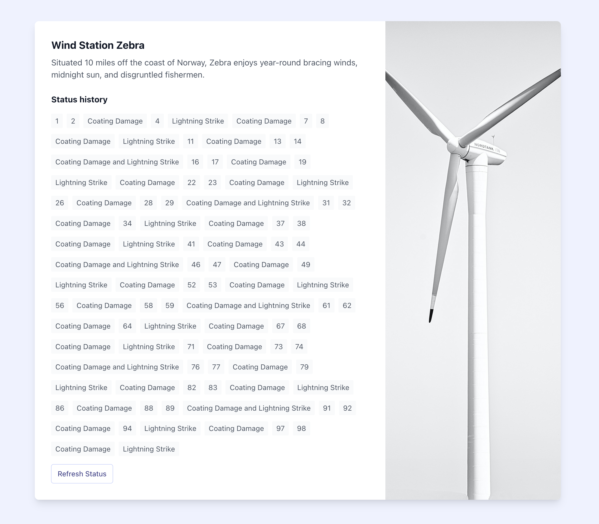

# Wind Turbine Project

A simple Laravel application developed for an interview. Attempts to tread the fine line between "enough to demonstrate my expertise" and "obviously overkill for such a small project".

Displays a dummy "status" page for a wind turbine. Clicking the "refresh status" button fetches the results from the server via an Ajax call (as requested in the brief).

## Tech stack
- Built using [Laravel 8][laravel], [Tailwind CSS][tailwind], and [Alpine.js][alpine].
- [PHP CS Fixer][php-cs-fixer] enforces coding style.
- [Husky][husky] automatically tests and lints code before commit and push.
- [GitHub Actions][gh-actions] keep the repository pristine.

[alpine]: https://github.com/alpinejs/alpine
[gh-actions]: https://github.com/features/actions
[husky]: https://typicode.github.io/husky/#/
[laravel]: https://laravel.com/
[php-cs-fixer]: https://github.com/FriendsOfPHP/PHP-CS-Fixer
[tailwind]: https://tailwindcss.com/

## Getting started
1. Choose your preferred [Laravel development environment](https://laravel.com/docs/8.x).
2. Clone the repository:    
   `git clone git@github.com:monooso/wind-turbine-project.git`
3. Copy the example environment file:    
   `cp .env.example .env`
4. Install the application dependencies:    
   `composer install`
5. Install the code quality tools:    
   `cd tools && composer install`
6. Set up Husky:    
   `husky install`
7. Copy the PHP CS Fixer configuration file:    
   `cp .php_cs.dist .php_cs`
8. Set up the application key:    
   `php artisan key:generate`
9. Run the test suite to confirm everything is working correctly:    
   `php artisan test`

## Credits
Photograph of wind turbine by [Nikolay Hristov](https://unsplash.com/@nikolayh?utm_source=unsplash&utm_medium=referral&utm_content=creditCopyText) via [Unsplash](https://unsplash.com/)
